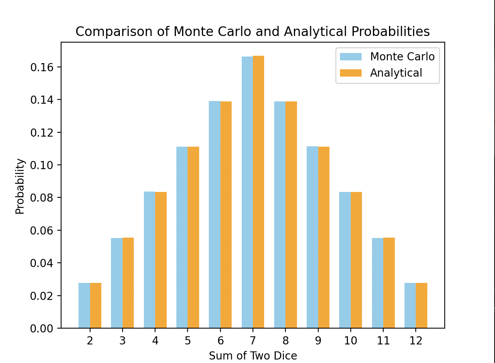

# Висновок

На основі проведених імітацій методом Монте-Карло та порівняння отриманих результатів з аналітичними розрахунками можна зробити такі висновки:

1. **Ймовірності, отримані методом Монте-Карло, дуже близькі до аналітичних ймовірностей**:

   - Для всіх можливих сум (від 2 до 12) ймовірності, отримані методом Монте-Карло, лише незначно відрізняються від аналітичних ймовірностей.
   - Відхилення для кожної суми не перевищують 0.51%.

2. **Найменші похибки були зафіксовані для сум з високою частотою**:

   - Для сум 7 та 8, де аналітичні ймовірності складають 16.67% та 13.89% відповідно, похибки становлять лише 0.18% та 0.00%.
   - Це свідчить про те, що метод Монте-Карло особливо точний для сум з більшою частотою.

3. **Середня похибка становить лише 0.22%**:

   - Такий низький рівень похибки підтверджує високу точність методу Монте-Карло при великій кількості імітацій (1,000,000 кидків кубиків у даному випадку).
   - Це свідчить про те, що метод Монте-Карло є надійним для оцінки ймовірностей у подібних задачах.

4. **Метод Монте-Карло підтверджує аналітичні розрахунки**:
   - Незначні відхилення між результатами, отриманими методом Монте-Карло, та аналітичними розрахунками, підтверджують правильність аналітичних розрахунків.
   - Метод Монте-Карло може використовуватися як перевірка аналітичних розрахунків у задачах з ймовірністю та статистикою.

### Рекомендації:

- Використання методу Монте-Карло для симуляцій в інших задачах з випадковими подіями також може бути ефективним, особливо при великій кількості імітацій.
- Для підвищення точності результатів слід збільшувати кількість імітацій, що зменшить випадкові відхилення.
- Метод Монте-Карло можна використовувати в поєднанні з аналітичними методами для підтвердження результатів і підвищення надійності висновків.

Таким чином, метод Монте-Карло є потужним інструментом для моделювання і оцінки ймовірностей, що підтверджено результатами даної симуляції.
